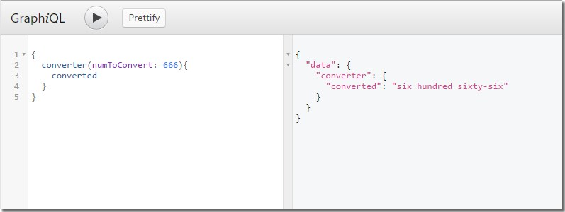

# NumberConverter
Quick test to convert numeric values to English phrasing on the command line or via a GraphQL service.
We're using mocha and chai for basic test cases, and babel for ES6 sugar.
The conversion is done by the handy `number-to-words` package. ;)

## Install

1. Clone this repo
2. Install dependencies:
  `npm install`
3. Run tests (Mocha/Chai):
  `npm test`

## Usages

1. (Master) branch: command line, using npm script to return converted values

```bash
$ npm run convert [number]
```
...where [number] represents any number, e.g.:
```bash
$ npm run convert 123

one hundred twenty-three
```

2. (apollo-webversion) branch: GraphQL server, with one query available:



Just switch to the following branch and start the server:
```bash
git checkout apollo-webversion
npm start
```
Then open your browser at [http://localhost:8080/graphql](http://localhost:8080/graphql), and use the query shown above to convert your numbers.
